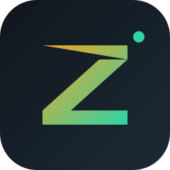
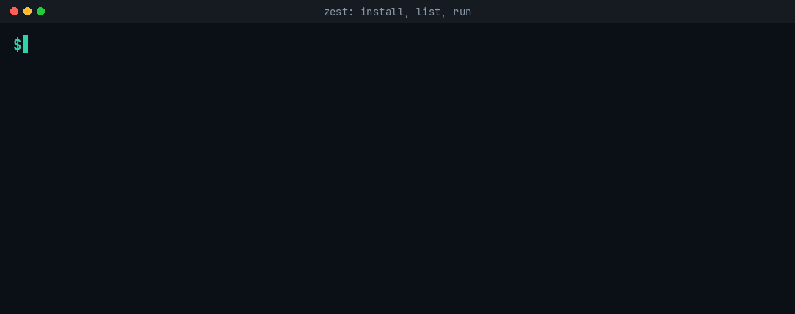
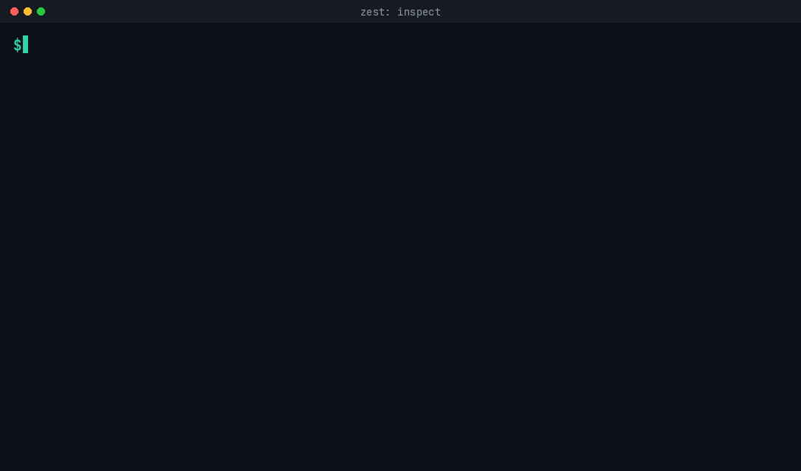
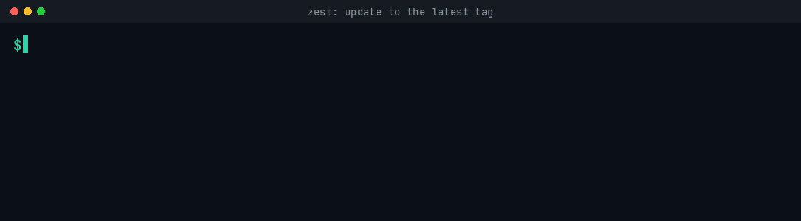

<div align="center">
  
  <h1>zest</h1>
  <p><strong>Zig executable staging tool</strong>: install, run, and upgrade CLI tools
     built from any git repository, compiled on your machine with the real Zig build pipeline.</p>
  <p>
    <a href="https://github.com/JustinWoodring/zest/actions/workflows/ci.yml"></a>
    <a href="LICENSE"></a>
    
    <a href="https://github.com/JustinWoodring/zest/releases"></a>
    <a href="https://github.com/JustinWoodring/zest/pulls"></a>
    <a href="https://github.com/sponsors/JustinWoodring"></a>
  </p>
  <p><a href="https://justinwoodring.github.io/zest">justinwoodring.github.io/zest</a></p>
</div>

---

## Quick start

**Linux & macOS**

```sh
curl -fsSL https://justinwoodring.github.io/zest/install.sh | sh
```

**Windows (PowerShell)**

```powershell
irm https://justinwoodring.github.io/zest/install.ps1 | iex
```

Both installers bootstrap a private Zig toolchain if your machine doesn't have
one (checksum-verified, no admin rights needed), build zest in ReleaseSafe, and
drop the binary into your user bin directory. Already installed? Re-running the
installer simply hands over to `zest self-update`.

Prefer to skip the build? Grab a static binary for your platform from
[Releases](https://github.com/JustinWoodring/zest/releases).

## What is zest?

Distributing a Zig CLI tool usually means "clone the repo, figure out the
build, remember where you put the binary, and repeat on every update." zest
turns that into one command:

```sh
zest install github.com/user/my-cli-tool
```

It clones the repository, compiles it in ReleaseSafe with your native Zig
toolchain, stages the binary under your user prefix, and records it locally.
Sources can be git URLs, host shorthands, or short names resolved through the
[Zigistry](https://zigistry.dev) registry, and tags, branches, or commit
hashes all work.

## Usage

```sh
zest install github.com/user/my-cli-tool        # build + install
zest install github.com/user/my-cli-tool@v1.2.0 # pick a version
zest run my-cli-tool --help                     # try without installing
zest update my-cli-tool                         # move to the latest release
zest remove my-cli-tool                         # clean up
zest list                                       # what's installed
zest inspect .                                  # is this a valid zest project?
zest inspect my-cli-tool                        # is my installed tool current?
zest self-update                                # upgrade zest itself
```

## Demo

### Install, list, and run

<p align="center">
  
</p>

### Inspect a project

<p align="center">
  
</p>

### Update to the latest tag

<p align="center">
  
</p>

## Inspect

`zest inspect` answers "is this installable, and is it current?" before you
install, or, for something already installed, whether it is out of date.

```sh
$ zest inspect .
zest inspect  my-cli-tool
location      .
version       1.4.2   (upstream v1.5.0, OUT OF DATE: `zest update my-cli-tool`)
minimum zig   0.16.0
description   A command-line tool for doing things.
license       MIT
author        Ada Lovelace <ada@example.com>
remote        https://github.com/user/my-cli-tool
zigistry      indexed  https://github.com/user/my-cli-tool  (43 stars)  (same repo as remote)
programs      my-cli-tool
verdict       installable  (zest installs "my-cli-tool")
```

- **A path (or bare `zest inspect`)** inspects the project in the current
  directory, reading `build.zig`, `build.zig.zon`, `README.md`, and `LICENSE`.
- **A URL** (`zest inspect github.com/user/my-cli-tool`) shallow-clones and
  inspects it, comparing the declared version against the latest upstream tag.
- **A package name** (`zest inspect my-cli-tool`) resolves through Zigistry,
  disambiguating if several packages share the name, then reports the installed
  version against upstream (`installed … behind upstream v…`) and its registry
  status.

The verdict (`installable`, `ambiguous`, `no_binaries`, `not_zest_project`)
reflects whether `zest install` would accept the project; the exit code is 0
for `installable` and 1 otherwise.

### What inspect checks

| Source | Meaning |
| --- | --- |
| `build.zig` | Scans for every `addExecutable` target and records its `.name` (or marks a computed name as dynamic). |
| `build.zig.zon` | Reads the declared name, version, and minimum zig version, ignoring comments and enum literals. |
| `README.md` | First prose paragraph becomes the description. |
| `LICENSE` | Sniffed for MIT, Apache-2.0, GPL, BSD, ISC, MPL, or Unlicense. |
| git | Last commit author and the `origin` remote. |
| upstream | `git ls-remote --tags` on the remote, compared against the declared version to flag `OUT OF DATE`. |
| Zigistry | Visibility of the tool name, the matching repo, star count, and collision candidates. |

The **verdict** mirrors what `zest install` will do:

- `installable`: exactly one program, or several where one is named after the
  tool (`mytool` from a repo that also builds `mytool-gen`).
- `ambiguous`: several programs and none matches the tool name, so zest
  refuses to guess.
- `no_binaries`: nothing runnable to link.
- `not_zest_project`: no `build.zig`.

## Built-in guarantees

- **Tagged releases by default.** zest tracks the latest semantic-version tag
  and only falls back to the default branch when a repo has no tags. master
  is never tracked when tagged releases exist. `@v1.2.0`, `@main`, and
  commit hashes are explicit overrides.
- **Multi-executable projects are handled.** If a build produces more than one
  program, zest installs the one named after the tool (e.g. `mytool` from a
  repo that also ships `mytool-gen`). When no binary unambiguously matches, it
  refuses and lists what was built rather than guessing.
- **Same-name registry packages are never guessed.** If several Zigistry
  programs share a name, zest refuses and shows the candidates (with stars and
  descriptions). Install one by its full source like
  `zest install github.com/owner/name`.
- **zest protects itself.** The name `zest` is reserved: no package can
  install, shadow, or remove the zest binary, and `--force` cannot bypass it.
  The only thing allowed to replace zest is `zest self-update`.
- **Atomic by design.** Manifest writes and binary installs are atomic, and a
  failed build always leaves the previous installation untouched.
- **Cross-platform.** Linux (x86_64, arm64), macOS (arm64), and Windows
  (x86_64, arm64), with release binaries attached to every tag.

| Release artifact | Platform |
| --- | --- |
| `zest-<ver>-x86_64-linux-musl.tar.gz` | Linux x86_64 |
| `zest-<ver>-aarch64-linux-musl.tar.gz` | Linux arm64 |
| `zest-<ver>-aarch64-macos.tar.gz` | macOS arm64 |
| `zest-<ver>-x86_64-windows-gnu.zip` | Windows x86_64 |
| `zest-<ver>-aarch64-windows-gnu.zip` | Windows arm64 |

## How it works

1. **Resolve** the source: git URL, host shorthand, Zigistry short name, and
   the target version (latest tag by default).
2. **Fetch**: shallow clone into `~/.local/share/zest/src/<tool>`.
3. **Build**: `zig build -p dist -Doptimize=ReleaseSafe` with your native
   toolchain.
4. **Link**: the binary appears in `~/.local/share/zest/bin`.
5. **Record**: the install manifest is updated atomically, only after a
   fully successful build.

The manifest (`state.json`) tracks every installed tool's source, version,
commit, and install time. Unknown fields are tolerated; no package can write
to it except zest itself.

## FAQ

<details>
<summary>Does zest run prebuilt binaries?</summary>
No. Everything is compiled on your machine with the real Zig build pipeline,
so there's nothing to trust but the source code and your own toolchain.
</details>

<details>
<summary>What if a project doesn't have tagged releases?</summary>
zest falls back to that repository's default branch and keeps working; when a
tag appears, new installs and updates pick it up automatically.
</details>

<details>
<summary>Where does everything live?</summary>
Everything is contained in one directory:
<code>$XDG_DATA_HOME/zest</code> (default <code>~/.local/share/zest</code>):
<code>bin/</code> for symlinks, <code>src/</code> for build staging,
<code>state.json</code> for the manifest. Removing a tool removes its files.
</details>

## Development

```sh
zig build test        # unit tests
zig build             # build the binary
./scripts/mock-e2e.sh      # hermetic end-to-end suite (no network)
./scripts/mock-install.sh  # installer suite (POSIX)
./scripts/mock-install.ps1 # installer suite (Windows)
```

CI runs the unit tests on Linux, macOS, and Windows; the e2e suite on all
three; both installer suites; and publishes every `v*` tag as a cross-built
release.

## Contributing

See [CONTRIBUTING.md](CONTRIBUTING.md) for the development workflow, code
style, and test requirements. Contributors are listed in [CONTRIBUTORS](CONTRIBUTORS).

## License

[MIT](LICENSE). Copyright (c) 2026 Justin Woodring.
